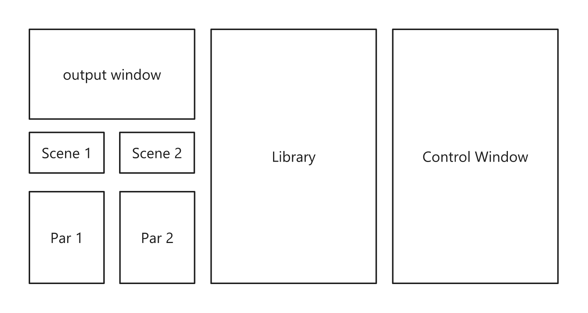

# TD-VJ_Performance_Rig
This will become a VJ Mixer completely made in Touchdesigner. It should have functions like library management, previews, Midi parameter auto-mapping. Currently the basic setup is done but it has a lot of bugs.

## Basic Functionality
### UI

The UI Widget has the following areas:
- left section
    - Output Window
    - scene loader and corresponding parameters
- middle section
    - visuals library
- right section
    - Midi Fighter Widget

### Library
The library loads external tox files from /tox/visuals as visuals in that folder are .tiff-images that are used as thumbnails.
These visuals will be stacked in a scrollable list that previews the thumbnails.
The visuals can be dragged onto the scene loader widget to load them into the decks.

### Parameters
This section shows the custom parameter page from the visuals loaded in the deck. 
By dragging and dropping the parameters onto knobs of the Midi Fighter Widget they get assigned to that knob. This connection should be stored in the visual so that it gets automatically assigned when the visual is reloaded.

It would be nice to add functionalities for other data assignments e.g. CHOPs

## Problems to fix
- all visuals in the library are cooking the whole time
    - there are two options of how to fix this: enable cooking when loaded in the deck or even using engines in the deck loader
- external tox midi fighter twister doesn't work
- visuals are loaded from tox files when reloading them parameter
- tox visuals need a name in the lib preview

## next tasks
- [x] rework library management
- [ ] visualize UI and its functions with flowchart
- [x] update drag and drop scripts
- [ ] update scene loader ->
    - [x] use engine
        - [x] update UI select tops to show visual sceneslots
        - [x] show engine info (engine_fps, engine_gpu_mem_used) in UI
        - [ ] create bar for total memory usage (engine1, engine2 and td network)
        - [ ] update engine callbacks to always connect them to the slot COMPs and video input if available
    - this is where output resolution will get applied
- [ ] fix midi twister assignments
- [ ] fix storing the assignments with the visuals
- [ ] visuals thumbnails are of size 1280x720 -> decrease it and test if hovering over the visuals can be used to enable cooking for previewing (or click on visual to preview)
- [ ] constantly comment out debug scripts and functions
- [ ] see if library toxes can be previewed upon hovering with smaller resolution
- [ ] update visual tox-files with new logic
    - only one output
    - resolution picker from a "setup" tab